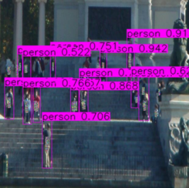
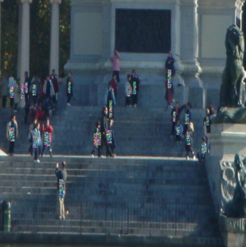

### Environment
```bash
conda create -n dassl python=3.7
conda activate dassl
pip install -r requirements.txt
```

### implementation
配置参数在配置文件中进行设置

部分配置参数仍定义在文件内部，例如是否保存plot、图像文件夹路径等
```shell
# for attack: config as configs/inria.yaml
python attackAPI.py

# for military attack: config as configs/default.yaml
python militaryAttackAPI.py
```

### utils
增加的工具类函数


```python
# data_reader.py
# 拟data loader图片准备：读入names中的img，并输出为 numpy batch
def read_img_np_batch(names, input_size):
    # return format: RGB [b, 3, h, w] (dtype=uint8)
    pass
    return img_numpy_batch

# utils.py
# 检测器间NMS
def inter_nms():
    # input: [N*6] preds list, list len=batch size
    pass
```

### 攻击框架API
#### 增加的通用跨模型部分
```python
# UniversalDetectorAttacker为继承类
class UniversalDetectorAttacker(DetctorAttacker):
    def __init__(self, cfg, device):
        super().__init__(cfg, device)
    
    # 初始化通用的攻击Patch
    def init_universal_patch(self, height=100, width=100):
        # save to self.universal_patch: [1, 3, height, width] tensor
        universal_patch = np.random.randint(low=0, high=255, size=(height, width, 3))
        universal_patch = np.expand_dims(np.transpose(universal_patch, (2, 0, 1)), 0)
        self.universal_patch = torch.from_numpy(np.array(universal_patch, dtype='float32')/255.).to(self.device)
        self.universal_patch.requires_grad = True
    
    # 根据攻击类别过滤预测框，并规范化检测框格式
    def get_patch_pos_batch(self, all_preds):
        # input all_preds: [N*6]的检测框list，其长度等于batch大小，bbox坐标为0~1
        # results save to self.batch_boxes
        pass
    
    # 根据已获取的规范化检测框，在图像中加入通用的攻击patch
    def uap_apply(self, numpy_batch, attacking=False):
        # 同时对universal_patch进行该检测器规定的预处理 detector.normalize_tensor()
        pass
    
    # 合并多个检测器的预测结果
    def merge_batch_pred(self, all_preds, preds):
        pass
        # return: 返回所有batch中是否存在一个以上有效目标
        return has_target

    # 所有检测器对 攻击后的img_batch 的检测结果，将batch的第一张保存到results/下
    def adv_detect_save(self, img_numpy_batch, save_postfix):
        pass
```


### 检测框架API
#### 通用跨模型增加部分
以FRCNN为例
```python
class FRCNN(object):
    def __init__(self, cfg, device):
        super().__init__(cfg, device)
    
    # numpy img batch转化为tensor batch，并进行该检测器规定的预处理
    def init_img_batch(self, img_numpy_batch):
        # 1、init numpy(RGB) batch (b, c, h, w) into (deviced) tensor batch
        # 2、preprocessing by internal detector e.g. mean-std normalization
        pass
    
    # 对img batch进行目标检测，返回检测框及置信度
    def forward(self, batch_tensor):
        # 功能为batch版本的detect_img_tensor_get_bbox_conf()
        pass
        return preds, confs
    
    # 对tensor进行检测器规定的normalize操作
    def normalize_tensor(self, tensor_data):
        # 如果需要normalize，需要对tensor_data的clone()进行操作
        # 否则直接返回即可
        return tensor_data
    
    # 没有特殊添加功能，仅为复用所改写函数：不直接被外部调用
    def box_rectify(self, result, image_shape):
        pass
```

### Pipeline elaboration
#### 通用跨模型攻击
一个带删减的简略pipeline

```python
#初始化clean的图像batch: RGB [b, 3, h, w] numpy
read_img_np_batch()
```


```python
# 调用所有检测器对 img_numpy_batch 进行目标检测
for detector in detectors:
    detector()
# 检测器间NMS
inter_nms()
# 获取所有的target初始目标locations
has_target = get_patch_pos_batch()

# 检查当前batch图像是否包含一个以上检测框，否则不进行攻击
if not has_target:
    continue
```


```python
# Sequential or Parallel attack
for i in range(cfg.MAX_ITER):
    for detector in detectors:
        # 获取攻击后的img_tensor
        adv_img_tensor = uap_apply()
        # 进行迭代攻击，（串/并行）更新universal_patch
        non_targeted_attack_batch(adv_img_tensor, detector)
```
目前攻击只写了第一种串行更新的方法
在条件
MAX_ITER=100，
ITER_STEP=2，
BATCH_SIZE=2下，
攻击一整轮所需时间:

对于military YOLOX、FAST RCNN：80s左右;

对于YOLOV4、YOLOV3：50s左右

### examples
attack examples from YOLOV3





see more attacked examples in results/